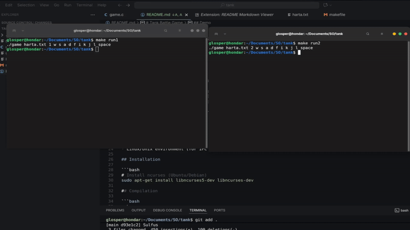

# Tank Battle Game

A two-player tank battle game implemented in C using shared memory and semaphores for process synchronization.

## Demo



## Features

- **Two-player gameplay** on the same keyboard
- **Separate processes** for each player using IPC (Inter-Process Communication)
- **Shared memory** for game state synchronization
- **Per-position semaphores** (400 semaphores for 20x20 grid) for fine-grained locking
- **Animated projectiles** that move until hitting a tank, wall, or boundary
- **Health system** with 5 HP per player
- **ncurses interface** for terminal-based graphics


## Requirements

- GCC compiler
- ncurses library
- Linux/Unix environment (for IPC primitives)

## Installation

```bash
# Install ncurses (Ubuntu/Debian)
sudo apt-get install libncurses5-dev libncurses-dev

## Compilation

```bash
make
```

To clean build artifacts and IPC resources:

```bash
make clean
```

## Running the Game

### Option 1: Using Makefile shortcuts

**Terminal 1 (Player A):**
```bash
make run1
```

**Terminal 2 (Player B):**
```bash
make run2
```

### Option 2: Manual execution

**Terminal 1:**
```bash
./game harta.txt A w s a d f i k j l space
```

**Terminal 2:**
```bash
./game harta.txt B w s a d f i k j l space
```

### Command-line Arguments

```bash
./game <map_file> <player_id> <A_up> <A_down> <A_left> <A_right> <A_fire> <B_up> <B_down> <B_left> <B_right> <B_fire>
```

- `map_file`: Path to the map file (e.g., `harta.txt`)
- `player_id`: Player identifier (A or B)
- Next 5 arguments: Controls for Player A (up, down, left, right, fire)
- Last 5 arguments: Controls for Player B (up, down, left, right, fire)

## Controls

### Default Controls

**Player A:**
- `w` - Move up
- `s` - Move down
- `a` - Move left
- `d` - Move right
- `f` - Fire projectile

**Player B:**
- `i` - Move up
- `k` - Move down
- `j` - Move left
- `l` - Move right
- `space` - Fire projectile

**Both players:**
- `q` or `Q` - Quit game

## Map Format

The map file (`harta.txt`) uses:
- `#` - Walls
- ` ` (space) - Open area
- Dimensions: 20×20 maximum

Example map:
```
####################
#        #        #
#        #        #
#        #        #
#                 #
#        #        #
#        #        #
#        #        #
#        #        #
####################
```

## Game Rules

1. Each player starts with 5 HP
2. Players can move in four directions and fire projectiles
3. Projectiles travel in the direction the tank is facing
4. Getting hit by a projectile reduces HP by 1
5. First player to reach 0 HP loses
6. Both players can be controlled from either terminal

## How It Works

Both processes share the same game state through System V shared memory. Each process:
1. Reads keyboard input for **both** players
2. Locks specific grid positions using semaphores before modification
3. Updates the shared game state
4. Unlocks positions after modification
5. Renders the current game state using ncurses

This architecture ensures thread-safe concurrent access while maximizing parallelism through fine-grained locking.
